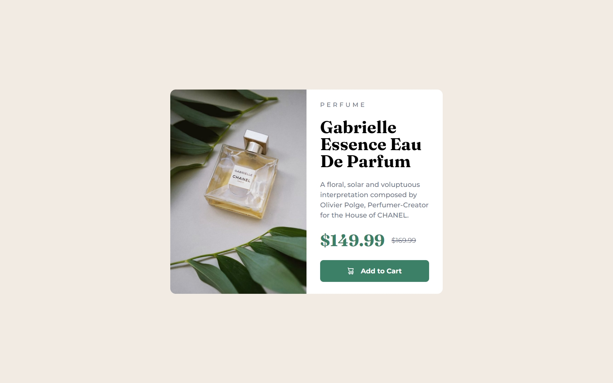

# Frontend Mentor - Product preview card component solution

This is a solution to the [Product preview card component challenge on Frontend Mentor](https://www.frontendmentor.io/challenges/product-preview-card-component-GO7UmttRfa). Frontend Mentor challenges help you improve your coding skills by building realistic projects. 

## Table of contents

- [Overview](#overview)
  - [The challenge](#the-challenge)
  - [Screenshot](#screenshot)
- [My process](#my-process)
  - [Built with](#built-with)
  - [Useful resources](#useful-resources)
- [Author](#author)

## Overview
This challenge was easy but at the same time it was fun to do. Very good for begginers.

### The challenge

Users should be able to:

- View the optimal layout depending on their device's screen size
- See hover and focus states for interactive elements

### Screenshot

## My process
- 1st: Made the html structure.
- 2nd: Style it with CSS.
- 3rd: Make it responsive for mobile users

### Built with

- Semantic HTML5 markup
- CSS custom properties
- Flexbox

### Useful resources

- [Example resource 1](https://nextline.es/web/texto-tachado-html/#:~:text=Tachando%20el%20texto%20con%20html,del%20texto%20que%20queramos%20tachar.&text=Y%20listo.) - This helped me to cross out the text of the previous price.

## Author

- Website - [Angel Henriquez](https://github.com/pr0g4ng3l)
- Frontend Mentor - [@pr0g4ng3l](https://www.frontendmentor.io/profile/pr0g4ng3l)
- Twitter - [@navimmii](https://twitter.com/navimmii)
